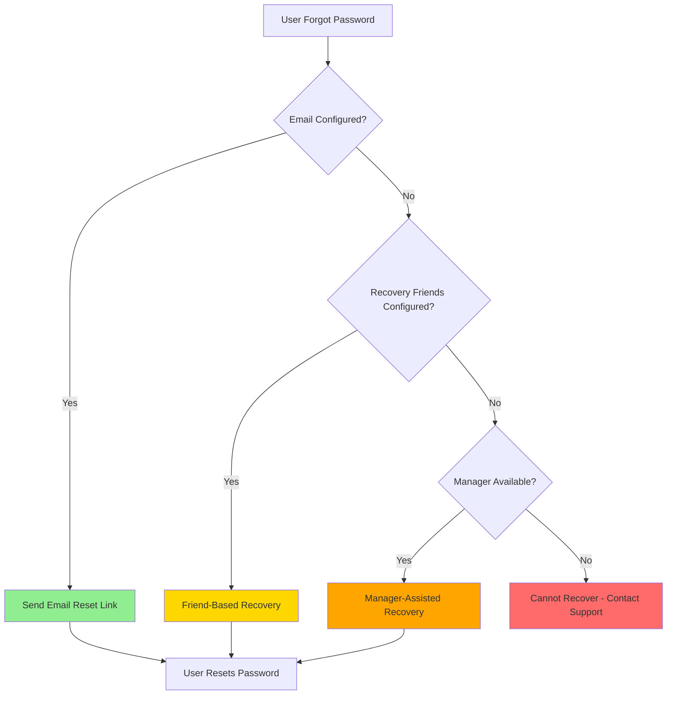

# Password Reset Flow - Multi-Tiered Recovery System

**Date:** November 10, 2025  
**Version:** 0.1.0-alpha.1  
**Status:** Design Specification (Frontend mockable, Backend pending)

---

## Overview

Unity Platform implements a **user-sovereignty-first** password reset system with multiple recovery tiers, ensuring users maintain control over their accounts while providing fallback options for recovery.

### Design Philosophy

- **No single point of failure**: Multiple independent recovery methods
- **Privacy-first**: Friend-based recovery requires multi-factor validation
- **Community support**: Territory/community managers as last resort
- **User control**: Recovery methods configured by user in advance

---

## Recovery Tiers (Priority Order)

### Tier 1: Email-Based Recovery (Primary) 🔐 ⭐ PREFERRED

**Availability:** When user has configured an email address

**Flow:**
1. User clicks "Forgot Password" on login page
2. System checks if user has verified email address
3. If yes, send password reset email with time-limited token
4. User clicks link in email → Reset password page
5. User enters new password
6. Password updated, user logged in

**Security:**
- Token expires after 1 hour
- Token single-use only
- Email must be verified to be used for reset
- Rate limiting: Max 3 reset requests per hour

**Implementation Status:**
- ✅ Frontend: Can be mocked (email service pending)
- ❌ Backend: Email service not yet implemented
- ❌ Backend: Password reset endpoints pending

---

### Tier 2: Friend-Based Recovery (Secondary) 👥 🔐

**Availability:** When user has configured trusted friends AND personal validation information

**Prerequisites (User Profile Configuration):**

User must configure in **Privacy Settings** before password is forgotten:

1. **Trusted Recovery Friends** (2-5 friends)
   - Select 2-5 friends from connections
   - Stored as `recovery_friends: [user_id_1, user_id_2, ...]`

2. **Personal Validation Information** (Secret Q&A)
   - Question: Custom question only user knows answer to
   - Answer: Hashed, stored securely
   - Example: "What was your first pet's name?"
   - Stored as: `recovery_question`, `recovery_answer_hash`

**Recovery Flow:**

#### Step 1: Initiate Recovery
1. User clicks "Forgot Password" on login page
2. System checks: No email OR email recovery failed
3. System shows: "Recover via Trusted Friends"
4. User enters username
5. System shows list of configured trusted friends (by username, not full names for privacy)

#### Step 2: Select Friend & Validate Identity
1. User selects one friend from the list
2. User enters the selected friend's **username** in a text field
3. System validates: Selected friend matches entered username
4. If validation passes → proceed to Step 3
5. If validation fails → "Friend validation failed" (3 attempts max)

**Why validate friend's username?**  
Prevents automated attacks where attacker doesn't actually know the user or their friends.

#### Step 3: Friend Receives Token
1. System generates `friend_recovery_token` (unique, time-limited)
2. Friend receives in-app notification:
   ```
   "Your friend @username needs help recovering their account.
    They will contact you for a recovery code.
    Token: FRT-XXXX-XXXX-XXXX
    Expires: 24 hours"
   ```
3. Token stored in database: `friend_recovery_tokens` table

#### Step 4: User Contacts Friend (Out-of-Band)
1. User contacts friend via **external channel** (phone, in-person, Signal, etc.)
2. Friend shares the token: `FRT-XXXX-XXXX-XXXX`
3. **Friend does NOT have ability to reset password alone** (by design)

#### Step 5: User Enters Token + Personal Information
1. User returns to password reset flow
2. User enters friend's recovery token
3. System shows: "Answer your security question to unlock reset"
4. User sees their configured personal question
5. User enters answer to personal validation question
6. System validates:
   - Token is valid and not expired
   - Token matches selected friend
   - Personal validation answer matches hash
7. If all pass → Allow password reset

#### Step 6: Reset Password
1. User enters new password (with confirmation)
2. Password updated, user logged in
3. Friend recovery token invalidated
4. Notification sent to all recovery friends: "Account password was reset"

**Security Properties:**

✅ **Multi-factor:**
- Something the user knows (friend's username)
- Someone the user knows (trusted friend relationship)
- Something only the user knows (personal validation answer)

✅ **Friend cannot reset alone:**  
Friend only has token, not the personal validation information

✅ **User cannot reset alone:**  
User needs token from friend (proves social relationship)

✅ **Prevents social engineering:**  
Attacker would need to:
1. Know user's trusted friends
2. Guess which friend user selected
3. Compromise friend's account to get token
4. Know answer to personal validation question

**Database Schema:**

```sql
-- User profile additions
ALTER TABLE user_profiles ADD COLUMN recovery_friends JSONB; -- Array of user IDs
ALTER TABLE user_profiles ADD COLUMN recovery_question TEXT;
ALTER TABLE user_profiles ADD COLUMN recovery_answer_hash TEXT;

-- Friend recovery tokens
CREATE TABLE friend_recovery_tokens (
    id UUID PRIMARY KEY DEFAULT gen_random_uuid(),
    user_id UUID NOT NULL REFERENCES users(id) ON DELETE CASCADE,
    friend_id UUID NOT NULL REFERENCES users(id) ON DELETE CASCADE,
    token VARCHAR(64) NOT NULL UNIQUE,
    created_at TIMESTAMPTZ NOT NULL DEFAULT NOW(),
    expires_at TIMESTAMPTZ NOT NULL,
    used BOOLEAN DEFAULT FALSE,
    used_at TIMESTAMPTZ,
    CONSTRAINT fk_user FOREIGN KEY (user_id) REFERENCES users(id),
    CONSTRAINT fk_friend FOREIGN KEY (friend_id) REFERENCES users(id)
);

CREATE INDEX idx_friend_recovery_tokens_token ON friend_recovery_tokens(token);
CREATE INDEX idx_friend_recovery_tokens_user ON friend_recovery_tokens(user_id);
```

**Rate Limiting:**
- Max 3 friend recovery attempts per 24 hours
- Max 3 personal validation attempts per token
- Token expires after 24 hours

---

### Tier 3: Manager-Assisted Recovery (Fallback) 👨‍💼 🔐

**Availability:** When email AND friend recovery are not configured

**Manager Types (Priority):**
1. **Community Manager** (if user is member of a community)
2. **Territory Manager** (fallback to territory level)

**Prerequisites (User Profile Configuration):**

User can configure in **Privacy Settings** before password is forgotten:

- **Secondary Validation Information** (for manager verification)
  - Examples:
    - "What city were you born in?"
    - "What is your mother's maiden name?"
    - "What was the name of your first school?"
  - Stored as: `manager_recovery_question`, `manager_recovery_answer_hash`

**Recovery Flow:**

#### Step 1: Request Manager Assistance
1. User clicks "Forgot Password" on login page
2. System checks: No email, no recovery friends configured
3. System shows: "Request assistance from your Community/Territory Manager"
4. User enters username
5. System shows form:
   - Reason for password reset request (text field)
   - User's configured secondary validation question (if exists)
   - Answer to validation question (if exists)

#### Step 2: Submit Recovery Request
1. User submits request
2. System creates `manager_recovery_request` record
3. System determines appropriate manager:
   - If user has primary community → Community Manager
   - Else → Territory Manager
4. Manager receives in-app notification + email (if configured):
   ```
   "Password reset request from @username
    Reason: [user's explanation]
    Validation: [if configured, show question]
    Request ID: MRR-XXXX-XXXX-XXXX"
   ```

#### Step 3: Manager Reviews Request
1. Manager opens **Account Recovery Dashboard**
2. Manager sees pending requests
3. Manager reviews:
   - User's username and profile
   - Request reason
   - Secondary validation answer (if user configured one)
   - User's account activity history
   - Previous recovery requests

#### Step 4: Manager Decision

**Option A: User configured secondary validation**
1. Manager verifies answer matches question
2. If match → Manager approves
3. System generates password reset token
4. User receives notification with token

**Option B: User did NOT configure secondary validation**

Manager has two paths:

**Path 1: Manager resets password directly (admin override)**
1. Manager clicks "Reset Password for User"
2. Manager confirms action (requires manager password)
3. System generates temporary password
4. User receives notification:
   ```
   "Your password has been reset by [Manager Name]
    Temporary password: [temp_password]
    You must change this password on first login."
   ```
5. User logs in with temp password
6. System forces password change on login

**Path 2: Manager requests additional verification**
1. Manager requests more information via message
2. User provides additional proof of identity
3. Manager manually verifies
4. Manager approves → Proceeds to reset

#### Step 5: Audit Trail
1. All manager-assisted resets logged:
   - Manager ID
   - User ID
   - Timestamp
   - Method (with/without validation)
   - IP addresses
2. Both user and manager receive confirmation
3. All configured recovery friends notified (if any)

**Security Properties:**

✅ **Last resort only:** Only available when other methods unavailable

✅ **Human verification:** Manager reviews request context

✅ **Optional self-service:** If user configured validation, manager just verifies answer

✅ **Admin override path:** Manager can reset without user input if needed (governance)

✅ **Full audit trail:** All actions logged and visible

⚠️ **Trust-based:** Requires trust in community/territory governance

**Database Schema:**

```sql
-- User profile additions
ALTER TABLE user_profiles ADD COLUMN manager_recovery_question TEXT;
ALTER TABLE user_profiles ADD COLUMN manager_recovery_answer_hash TEXT;

-- Manager recovery requests
CREATE TABLE manager_recovery_requests (
    id UUID PRIMARY KEY DEFAULT gen_random_uuid(),
    user_id UUID NOT NULL REFERENCES users(id) ON DELETE CASCADE,
    manager_id UUID REFERENCES users(id) ON DELETE SET NULL,
    request_reason TEXT NOT NULL,
    validation_answer TEXT, -- User's answer (if configured)
    status VARCHAR(20) NOT NULL DEFAULT 'pending', -- pending, approved, rejected, expired
    created_at TIMESTAMPTZ NOT NULL DEFAULT NOW(),
    resolved_at TIMESTAMPTZ,
    resolution_method VARCHAR(50), -- validation_match, admin_override, additional_verification
    notes TEXT, -- Manager's notes
    CONSTRAINT fk_user FOREIGN KEY (user_id) REFERENCES users(id),
    CONSTRAINT fk_manager FOREIGN KEY (manager_id) REFERENCES users(id)
);

CREATE INDEX idx_manager_recovery_status ON manager_recovery_requests(status);
CREATE INDEX idx_manager_recovery_user ON manager_recovery_requests(user_id);
CREATE INDEX idx_manager_recovery_manager ON manager_recovery_requests(manager_id);

-- Password reset audit log
CREATE TABLE password_reset_audit (
    id UUID PRIMARY KEY DEFAULT gen_random_uuid(),
    user_id UUID NOT NULL REFERENCES users(id) ON DELETE CASCADE,
    reset_method VARCHAR(50) NOT NULL, -- email, friend_recovery, manager_assisted
    initiated_by UUID REFERENCES users(id), -- NULL for self-service, manager_id for assisted
    ip_address INET,
    user_agent TEXT,
    created_at TIMESTAMPTZ NOT NULL DEFAULT NOW(),
    success BOOLEAN NOT NULL,
    CONSTRAINT fk_user FOREIGN KEY (user_id) REFERENCES users(id),
    CONSTRAINT fk_initiator FOREIGN KEY (initiated_by) REFERENCES users(id)
);

CREATE INDEX idx_password_reset_audit_user ON password_reset_audit(user_id);
CREATE INDEX idx_password_reset_audit_date ON password_reset_audit(created_at);
```

**Rate Limiting:**
- User: Max 1 manager recovery request per 7 days
- Manager: Unlimited reviews (they're trusted role)

**Manager Permissions:**

Requires role: `community_manager` OR `territory_manager`

```rust
// Rust permission check
async fn can_reset_user_password(manager_id: Uuid, user_id: Uuid) -> Result<bool> {
    // Check if manager has community_manager role for user's community
    // OR territory_manager role for user's territory
}
```

---

## Recovery Method Priority Logic



---

## User Configuration Requirements

### Privacy Settings Page

Users should configure recovery methods in **Settings → Privacy → Account Recovery**:

```tsx
interface AccountRecoverySettings {
    // Tier 1: Email (automatic if email is verified)
    email_verified: boolean;
    
    // Tier 2: Friend-Based Recovery
    recovery_friends: string[]; // Array of user IDs (2-5 friends)
    recovery_question: string;
    recovery_answer: string; // Will be hashed
    
    // Tier 3: Manager-Assisted Recovery
    manager_recovery_question: string;
    manager_recovery_answer: string; // Will be hashed
}
```

**UI Recommendations:**

1. **Onboarding prompt:** After registration, suggest configuring recovery methods
2. **Dashboard reminder:** If no recovery methods configured, show warning
3. **Email verification:** Encourage email verification for easiest recovery
4. **Friend selection:** Search/select from user's connections
5. **Security questions:** Pre-defined question bank + custom option

---

## Frontend Implementation Plan

### Pages to Create

1. **`/forgot-password`** - Entry point
   - Username input
   - Detect available recovery methods
   - Route to appropriate flow

2. **`/forgot-password/email`** - Email recovery
   - Show "Email sent" message
   - Resend option (rate limited)

3. **`/forgot-password/friend`** - Friend-based recovery
   - Step 1: Select friend + validate username
   - Step 2: Enter friend's token
   - Step 3: Answer personal question
   - Step 4: Reset password

4. **`/forgot-password/manager`** - Manager-assisted
   - Submit request form
   - Show request status
   - Wait for manager approval

5. **`/reset-password/:token`** - Email reset landing
   - Validate token
   - New password form
   - Success confirmation

6. **`/settings/privacy/recovery`** - Configure recovery methods
   - Email verification status
   - Add/remove recovery friends
   - Set personal validation questions
   - Set manager validation questions

### Manager Dashboard

7. **`/admin/recovery-requests`** - Manager view (new)
   - List pending requests
   - Review request details
   - Approve/reject/request more info
   - View audit log

---

## Security Considerations

### Threat Model

**Attack Scenarios:**

1. **Email compromise** → Use friend or manager recovery
2. **Friend account compromise** → Still need personal validation answer
3. **Social engineering friend** → Friend can't reset alone (needs user's answer)
4. **Malicious manager** → Full audit trail, territory governance oversight
5. **Brute force answers** → Rate limiting, account lockout after 3 failures

### Best Practices

✅ **Hash all recovery answers:** Use bcrypt/argon2  
✅ **Time-limited tokens:** All tokens expire  
✅ **Single-use tokens:** Cannot reuse recovery tokens  
✅ **Rate limiting:** Prevent brute force attempts  
✅ **Audit logging:** Track all password reset attempts  
✅ **Notifications:** Alert user on all password changes  
✅ **Multi-factor:** Combine multiple verification methods  

---

## Implementation Phases

### Phase 1: MVP (Email-based only) - Stage 5
- ✅ Frontend: Forgot password page (mockable)
- ❌ Backend: Email service integration
- ❌ Backend: Password reset endpoints
- ✅ Frontend: Reset password page

### Phase 2: Friend-based Recovery - Stage 6
- ❌ Frontend: Privacy settings - recovery friends configuration
- ❌ Frontend: Friend-based recovery flow
- ❌ Backend: Friend recovery token system
- ❌ Backend: Personal validation questions
- ❌ Backend: In-app notifications for friends

### Phase 3: Manager-assisted Recovery - Stage 7
- ❌ Frontend: Manager recovery request form
- ❌ Frontend: Manager dashboard for requests
- ❌ Backend: Manager recovery request system
- ❌ Backend: Manager permissions and roles
- ❌ Backend: Audit logging

### Phase 4: Polish & Security - Stage 8
- ❌ Rate limiting implementation
- ❌ Comprehensive audit logging
- ❌ Security testing
- ❌ Documentation for users
- ❌ Recovery method analytics

---

## API Endpoints (Backend Planning)

### Password Reset Endpoints

```typescript
// Initiate recovery
POST /api/v1/auth/password-reset/initiate
{
    username: string
}
Response: {
    available_methods: ['email' | 'friend' | 'manager'],
    recovery_friends?: string[], // Usernames (if friend recovery available)
}

// Email-based
POST /api/v1/auth/password-reset/email
{ username: string }
Response: { message: "Email sent if account exists" }

POST /api/v1/auth/password-reset/verify-token/:token
Response: { valid: boolean, user_id?: string }

POST /api/v1/auth/password-reset/complete
{ token: string, new_password: string }

// Friend-based
POST /api/v1/auth/password-reset/friend/initiate
{ username: string, friend_username: string }
Response: { token_sent_to_friend: boolean }

POST /api/v1/auth/password-reset/friend/validate
{
    username: string,
    friend_token: string,
    validation_answer: string
}
Response: { valid: boolean, reset_token?: string }

// Manager-assisted
POST /api/v1/auth/password-reset/manager/request
{
    username: string,
    reason: string,
    validation_answer?: string
}
Response: { request_id: string, status: 'pending' }

GET /api/v1/auth/password-reset/manager/request/:id
Response: { request: ManagerRecoveryRequest }

// Manager endpoints
GET /api/v1/admin/recovery-requests
Response: { requests: ManagerRecoveryRequest[] }

POST /api/v1/admin/recovery-requests/:id/approve
{ validation_passed?: boolean, notes?: string }

POST /api/v1/admin/recovery-requests/:id/reset-password
{ temp_password: string, notes?: string }
```

---

## Testing Checklist

### Email Recovery
- [ ] Valid username initiates email
- [ ] Invalid username shows generic message (security)
- [ ] Email contains valid reset link
- [ ] Token expires after 1 hour
- [ ] Token is single-use
- [ ] Rate limiting prevents spam
- [ ] Password complexity validated
- [ ] User logged in after successful reset
- [ ] All sessions invalidated except new one

### Friend Recovery
- [ ] User can configure 2-5 recovery friends
- [ ] Friend username validation works
- [ ] Friend receives in-app notification
- [ ] Token expires after 24 hours
- [ ] Personal validation answer required
- [ ] Wrong validation answer blocks reset
- [ ] Rate limiting prevents brute force
- [ ] All friends notified after password change

### Manager Recovery
- [ ] Request sent to correct manager
- [ ] Manager can view pending requests
- [ ] Manager can approve with validation
- [ ] Manager can reset without validation (override)
- [ ] Audit log captures all actions
- [ ] User notified of manager reset
- [ ] Temporary password enforces change on login

---

## User Documentation

### Help Article: "How to Reset Your Password"

**If you have configured an email address:**
1. Click "Forgot Password" on the login page
2. Enter your username
3. Check your email for a reset link
4. Click the link and enter a new password

**If you have configured recovery friends:**
1. Click "Forgot Password" on the login page
2. Enter your username
3. Select one of your trusted friends
4. Enter that friend's username to confirm
5. Contact your friend outside of the platform
6. Get the recovery code from your friend
7. Enter the code and answer your security question
8. Create a new password

**If you have not configured email or friends:**
1. Click "Forgot Password" on the login page
2. Enter your username
3. Submit a recovery request to your community or territory manager
4. Wait for manager approval
5. Follow the instructions from your manager

**Best Practice:**
- Configure your email address (easiest recovery)
- Add 2-5 trusted friends as recovery contacts
- Set up security questions you'll remember
- Keep your contact information up to date

---

## Changelog

**November 10, 2025** - Initial specification
- Multi-tiered password reset system designed
- Friend-based recovery with dual-factor validation
- Manager-assisted fallback with audit trail
- Database schema defined
- API endpoints planned
- Frontend mockable for Stage 5

---

**Next Steps:**
1. Create mockable frontend pages for email recovery (Stage 5)
2. Implement email service backend (Stage 6)
3. Build friend-based recovery (Stage 6)
4. Implement manager-assisted recovery (Stage 7)
